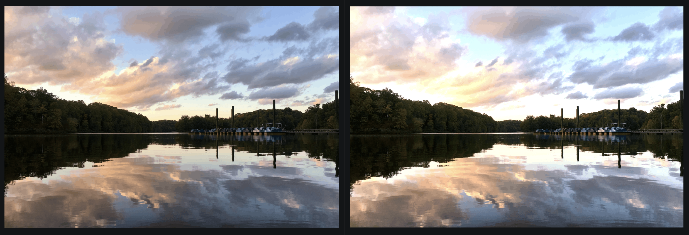
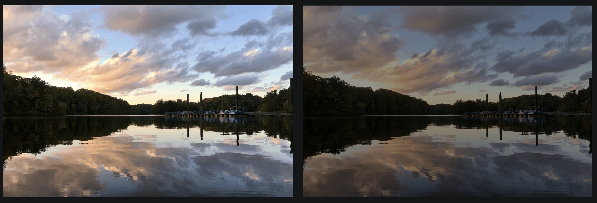
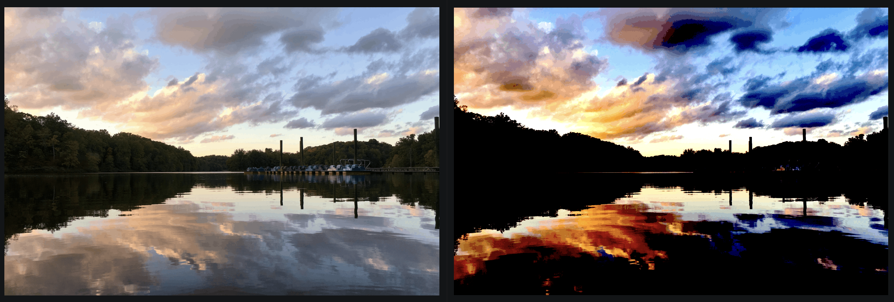
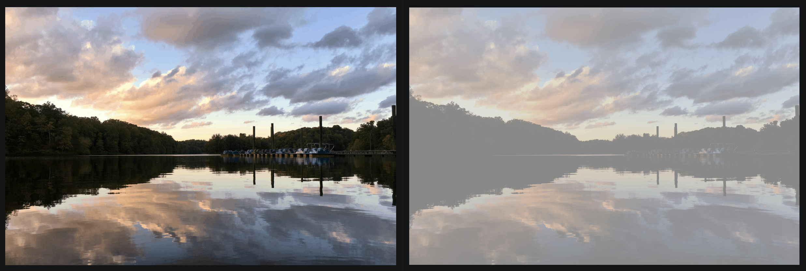

# 11 Photo Manipulation in Python

## Overview

This project is a simple photo manipulation Python script based on Kylie Ying's Beginner Python Projects Course. It allows you to perform various image editing operations on input images, producing manipulated versions as output.

## Features

- Brightening: Adjust the brightness of an image by multiplying each pixel value by a specified factor.
- Contrast Adjustment: Modify the contrast of an image by scaling the pixel values around a user-defined midpoint.
- Blur: Apply a blur effect to an image using a specified kernel size.
- Sobel Edge Detection: Detect edges in an image using the Sobel operator, which calculates the gradient magnitude.
- Combine Images: Combine two images by calculating the squared sum of their pixel values.

## How It Works

### 1. Brightening

The `brighten` function increases the brightness of an image by multiplying each pixel value by a factor greater than 1.0. This is achieved either through a nested loop or a vectorized operation using NumPy.

    

    

### 2. Contrast Adjustment

The `adjust_contrast` function adjusts the contrast of an image by scaling the pixel values around a specified midpoint. This is done by subtracting the midpoint, scaling by a factor, and then adding the midpoint back. Both nested loop and vectorized approaches are implemented.

    

    

### 3. Blur

The `blur` function applies a blur effect to an image by averaging pixel values in a neighborhood defined by a kernel size. This is achieved through nested loops.

    

### 4. Sobel Edge Detection

The `apply_kernel` function performs edge detection using the Sobel operator. It convolves the image with a Sobel kernel to calculate the gradient magnitude in both the x and y directions. The results are combined to detect edges.

### 5. Combine Images

The `combine_images` function combines two images by calculating the squared sum of their pixel values. This is useful for creating composite images, such as edge detection results.

    

## Usage

1. Ensure you have Python installed on your system.
2. Install the required dependencies listed in `requirements.txt` using `pip`.
3. Place your input images in the `input` directory.
4. Run `transform.py` to perform image manipulations.
5. Manipulated images will be saved in the `output` directory.

### How to Download the setup of PyPhotoshop

_Note: Kylie Ying's instructions_ 👇

**Python implementation of image filters**: Use Python to adjust brightness and contrast, add blur, and detect edges! Follow along tutorial: https://youtu.be/4ifdUQmZqhM

In order to download this code, either click the green button at the top right and download as ZIP, or use `git clone https://github.com/kying18/pyphotoshop.git`. You will need to `pip install -r requirements.txt` (or use `pip3` if you are getting a module not found error).

In the folder, you will find these files:
- image.py: contains the `Image` class that will read and write the images using the PNG `Writer` and `Reader`
- png.py: pure Python PNG `Reader` and `Writer` classes from Johann C. Rocholl
- transform.py: implemented image filter functions
- transform_empty.py: empty template for image filter functions

## Credits

This project is based on the Python Image Manipulation tutorial by Kylie Ying.

---

Completed: ２０２４年０３月２１日（木）

